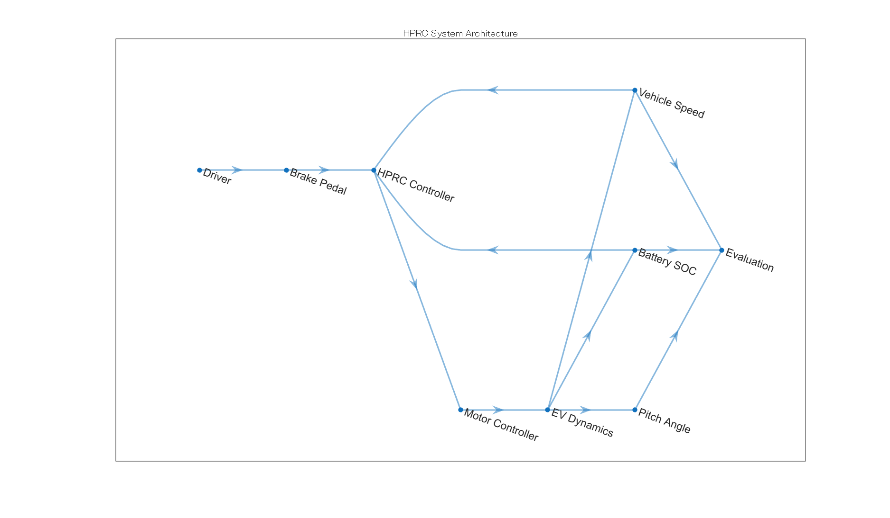
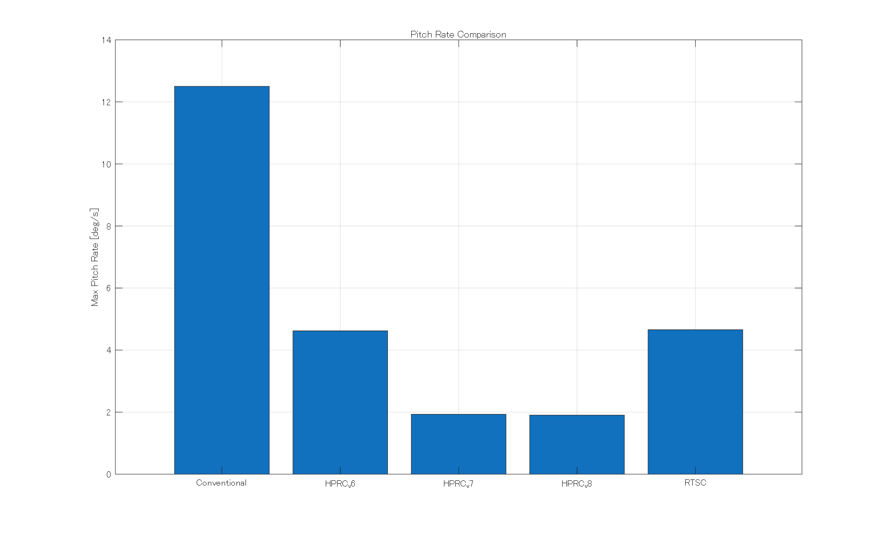
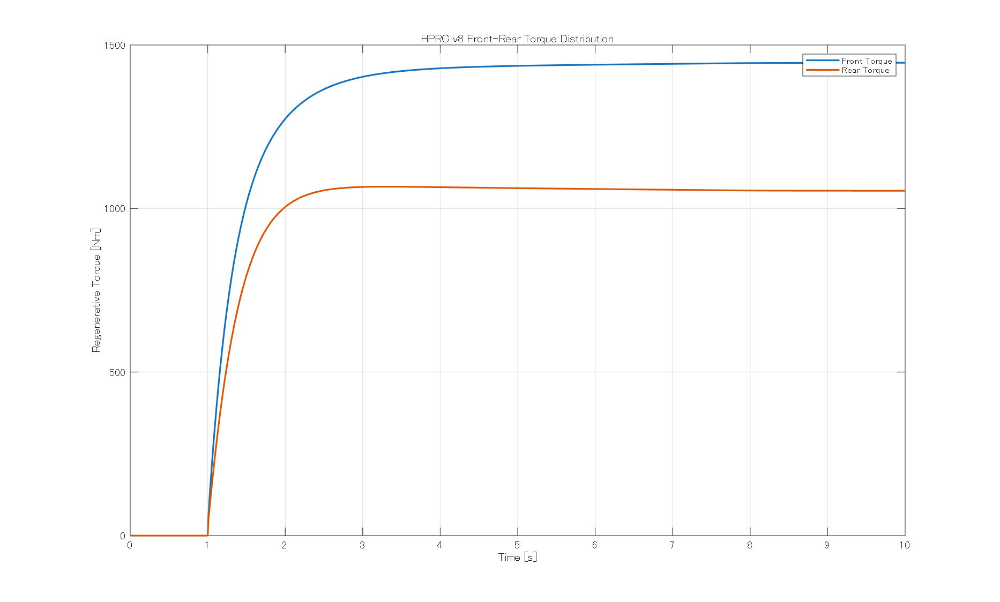
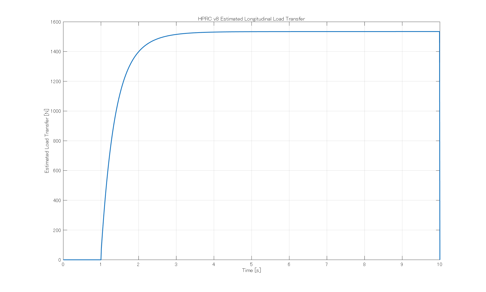
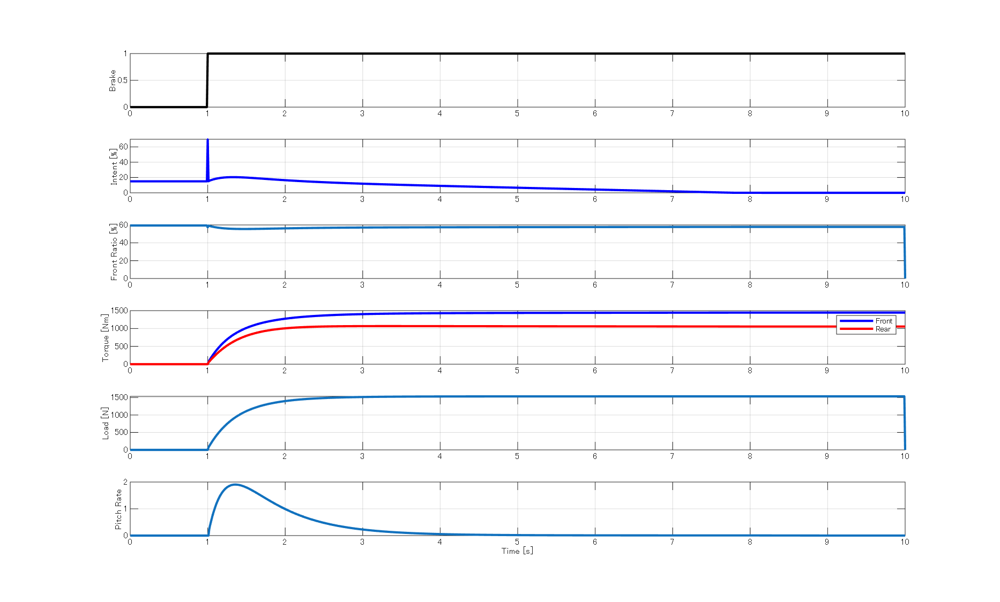

# 🚗 Human-Centered Predictive Regenerative Control (HPRC)


**MATLAB | Simulink | Electric Vehicle Control | Model-Based Development**

A human-centered regenerative braking control strategy for electric vehicles that predicts driver braking intention and longitudinal load transfer to suppress vehicle pitch motion while maintaining braking performance.

---

# Overview

This project proposes **Human-Centered Predictive Regenerative Control (HPRC)** for electric vehicles.

The controller estimates driver braking intention, predicts longitudinal load transfer, and adaptively distributes regenerative torque between the front and rear axles. The objective is to improve ride comfort by reducing vehicle pitch motion while maintaining braking performance.

The controller was developed in **MATLAB** and further implemented in **Simulink** using a model-based development (MBD) approach.

---

# Highlights

- Human Intent Estimation
- Longitudinal Load Transfer Estimation
- Adaptive Front–Rear Regenerative Torque Distribution
- MATLAB & Simulink Implementation
- Robustness Evaluation
- Parameter Sensitivity Analysis

---

# Control Architecture

```text
Brake Pedal
      │
      ▼
Human Intent Estimator
      │
      ▼
Load Transfer Estimator
      │
      ▼
Front Ratio Planner
      │
      ▼
Torque Distributor
      │
      ▼
Front / Rear Regenerative Torque
      │
      ▼
Pitch Dynamics
      │
      ▼
Vehicle Motion
```

---

# Simulation Results

| Method | Stop Time (s) | Max Pitch Angle (deg) | Max Pitch Rate (deg/s) |
|---------|--------------:|----------------------:|------------------------:|
| Conventional | 7.40 | 5.000 | 12.5000 |
| RTSC | 7.80 | 5.000 | 4.6568 |
| **HPRC v8** | **7.81** | **2.1533** | **1.8991** |

Compared with RTSC, HPRC v8 reduced maximum pitch angle by approximately **57%** and maximum pitch rate by approximately **59%** while maintaining nearly identical stopping performance.

---

# Initial Speed Test

Vehicle speeds of **40, 60, 80, 100 and 120 km/h** were evaluated.

The proposed controller maintained stable stopping performance while consistently suppressing pitch motion across all tested speeds.

---

# Brake Pattern Test

Brake patterns:

- Weak braking
- Medium braking
- Strong braking
- Progressive (Step-up) braking

| Method | Max Pitch Rate (deg/s) |
|---------|-----------------------:|
| RTSC | 2.3372 |
| **HPRC v8** | **0.9339** |

Approximately **60% reduction** during progressive braking.

---

# Road Friction Test

| Road Surface | μ | Method | Stop Time (s) | Max Pitch Rate (deg/s) |
|--------------|---:|---------|--------------:|-----------------------:|
| Dry | 1.0 | Conventional | 7.40 | 12.5000 |
| Dry | 1.0 | RTSC | 7.80 | 4.6568 |
| Dry | 1.0 | **HPRC v8** | **7.81** | **1.8991** |
| Wet | 0.6 | Conventional | 7.40 | 12.5000 |
| Wet | 0.6 | RTSC | 7.80 | 4.6568 |
| Wet | 0.6 | **HPRC v8** | **7.81** | **1.8991** |
| Low-μ Road | 0.3 | Conventional | 10.44 | 8.4758 |
| Low-μ Road | 0.3 | RTSC | 10.84 | 3.1576 |
| Low-μ Road | 0.3 | **HPRC v8** | **10.84** | **1.3341** |

---

# Parameter Sensitivity

| risk_gain | Stop Time (s) | Max Pitch Rate (deg/s) |
|-----------:|--------------:|-----------------------:|
| 0.10 | 7.80 | 1.9231 |
| 0.12 | 7.80 | 1.9171 |
| 0.14 | 7.81 | 1.9111 |
| **0.18 (Selected)** | **7.81** | **1.8991** |
| 0.20 | 7.82 | 1.8932 |

Although 0.20 produced a slightly lower pitch rate, **0.18** was selected as the best trade-off between ride comfort and braking performance.

---

# Simulink Validation

| Mode | Stop Time (s) | Max Pitch Rate (Normalized) |
|------|--------------:|----------------------------:|
| Conventional | 7.41 | 0.275 |
| **HPRC v8** | **7.41** | **0.170** |

The Simulink implementation achieved approximately **38% reduction** in pitch rate while maintaining the same stopping performance.

---

# System Architecture



---

# Pitch Angle Comparison



---

# Pitch Rate Comparison



---

# Front / Rear Regenerative Torque



---

# Estimated Load Transfer


---

# Future Work

- Four-wheel independent regenerative braking
- Adaptive road friction estimation
- Integrated pitch–yaw control
- e-Axle control
- Hardware-in-the-loop (HIL)
- Experimental vehicle validation
- Real-time embedded implementation

---

# Development Environment

- MATLAB R2026a
- Simulink
- Windows 11

---

# Keywords

Electric Vehicle, Regenerative Braking, Vehicle Dynamics, Predictive Control, Human-Centered Control, MATLAB, Simulink, Model-Based Development, e-Axle

---

# Author

**Haruto Doi (土井 陽斗)**

Faculty of Information Sciences  
Hiroshima City University

**Research Interests**

- Electric Vehicle Control
- Vehicle Dynamics
- Regenerative Braking
- MATLAB / Simulink
- Model-Based Development

📧 **haruto.doi2005@gmail.com**
